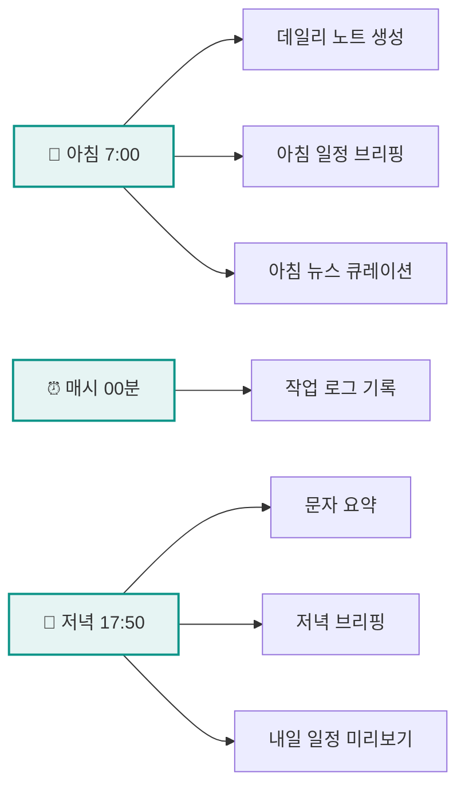

 

# 👋 안녕하세요, 류웅수입니다!

### 🏠 부동산 중개사 &nbsp;|&nbsp; 🤖 AI 자동화 엔지니어링

 

**"부동산과 AI의 크로스오버"**

---

## 📊 About Me

 

&nbsp;

 

### 🎯 Current Focus

| 📚 공인중개사 1차 | 🏢 지식산업센터 | 🤖 AI 자동화 | 📝 PKM 시스템 |
|:---:|:---:|:---:|:---:|
| 민법, 부동산학개론 | 덕은, 향동 전문 | NotebookLM, Claude | 옵시디언 PARA |

 

---

## 🛠 Tech Stack

 

### 🐍 Languages

### 🤖 AI & Automation

### 📱 Platforms & Services

 

---

## 🚀 What I'm Building

### 🏠 구해줘 부동산 자동화 시스템

 

 

| 자동화 | 설명 | 도구 |
|:---:|:---|:---|
| **🧠 퀴즈 생성** | 공인중개사 1차 기출문제 (09:00~17:00) | NotebookLM |
| **📰 뉴스 큐레이션** | 경제/부동산/IT 주요 뉴스 | 네이버 API |
| **📱 문자 요약** | 하루 문자/iMessage 요약 | Messages DB |
| **📅 일정 관리** | 5개 캘린더 통합 브리핑 | Google Calendar |
| **📝 작업 로그** | 옵시디언 + 텔레그램 동시 저장 | Obsidian MCP |

 

---

## 📈 GitHub Activity

 

 

 

---

## 📫 Get in Touch

 

 

---

**"함께 알면 더 똑똑해진다"**

AI와 함께 문제를 해결하는 새로운 장인정신

 

